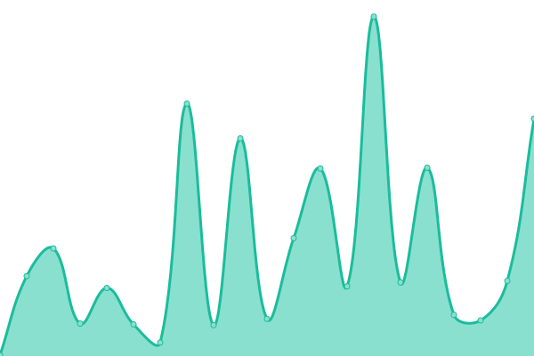

# [📈 Live Status](https://bdiaa248.github.io/vexl-status): <!--live status--> **🟧 Partial outage**

This repository contains the open-source uptime monitor and status page for [Abdelrahman Diaa](https://diaa-portfolio-pi.vercel.app/), powered by [Upptime](https://github.com/upptime/upptime).

With [Upptime](https://upptime.js.org), you can get your own unlimited and free uptime monitor and status page, powered entirely by a GitHub repository. We use [Issues](https://github.com/bdiaa248/vexl-status/issues) as incident reports, [Actions](https://github.com/bdiaa248/vexl-status/actions) as uptime monitors, and [Pages](https://bdiaa248.github.io/vexl-status) for the status page.

<!--start: status pages-->
<!-- This summary is generated by Upptime (https://github.com/upptime/upptime) -->
<!-- Do not edit this manually, your changes will be overwritten -->
<!-- prettier-ignore -->
| URL | Status | History | Response Time | Uptime |
| --- | ------ | ------- | ------------- | ------ |
|  [VEXL Backend API](https://vexl-website-production.up.railway.app/health) | 🟩 Up | [vexl-backend-api.yml](https://github.com/bdiaa248/vexl-status/commits/HEAD/history/vexl-backend-api.yml) | 

 923ms
     
 | 

<a href="https://bdiaa248.github.io/vexl-status/history/vexl-backend-api">100.00%</a>
    

|  [VEXL Official Website](https://www.vexl-gis.tech) | 🟥 Down | [vexl-official-website.yml](https://github.com/bdiaa248/vexl-status/commits/HEAD/history/vexl-official-website.yml) | 

 35ms
     
 | 

<a href="https://bdiaa248.github.io/vexl-status/history/vexl-official-website">0.00%</a>
    

<!--end: status pages-->

[**Visit our status website →**](https://bdiaa248.github.io/vexl-status)

## 📄 License

- Powered by: [Upptime](https://github.com/upptime/upptime)
- Code: [MIT](./LICENSE) © [Anand Chowdhary](https://anandchowdhary.com), supported by [Pabio](https://pabio.com)
- Data in the `./history` directory: [Open Database License](https://opendatacommons.org/licenses/odbl/1-0/)
